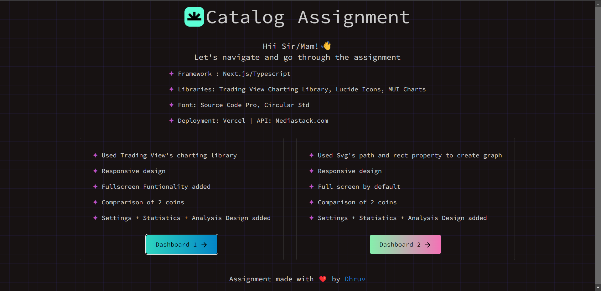
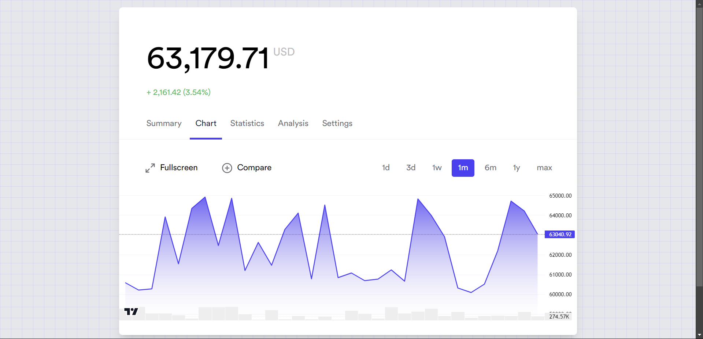
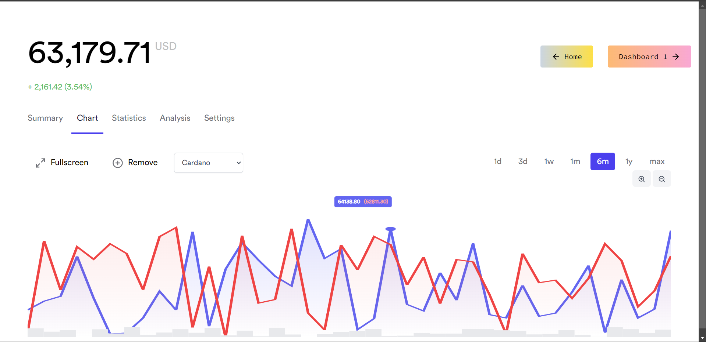
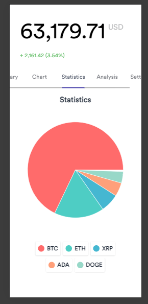

# Frontend Assignment for Catalog

This project is the assignment given to us by Catalog

## Screenshots








### Responsive [Mobile Devices]



## Languages/Tools

<a href="">
    
  </a>

## 👩🏽‍💻 Demo

Check out the website: [Website](https://catalog-assignment-dhruvkotwani.vercel.app/)

## 🚀 Running Frontend

To run locally, run the following commands to run node modules and serve the website locally.

```bash
yarn install
```

```bash
yarn run dev
```

<hr/>

## Drop a ⭐ if you like this project.
